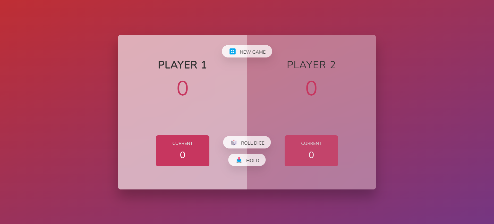

# Dice Roller

A simple dice rolling game built with HTML, CSS, and JavaScript.

## Table of Contents

- [Demo](#demo)
- [Screenshot](#screenshot)
- [Features](#features)
- [Installation](#installation)
- [Usage](#usage)

## Demo

You can view a live demo of the game [here](https://hananeaitbenyachou.github.io/Dice-Roller/).

## Screenshot



## Features

- Roll the dice to accumulate points.
- Hold your score to save it.
- First player to reach 100 points wins.
- Simple and intuitive user interface.

## Installation

To run this game locally, follow these steps:

1. Clone the repository:
    ```bash
    git clone https://github.com/HananeAitBenYachou/Dice-Roller.git
    ```

2. Navigate to the project directory:
    ```bash
    cd Dice-Roller
    ```

3. Open `index.html` in your preferred web browser.

## Usage

- Click the "Roll Dice" button to roll the dice.
- Click the "Hold" button to save your current score.
- Click the "New Game" button to reset the game.
